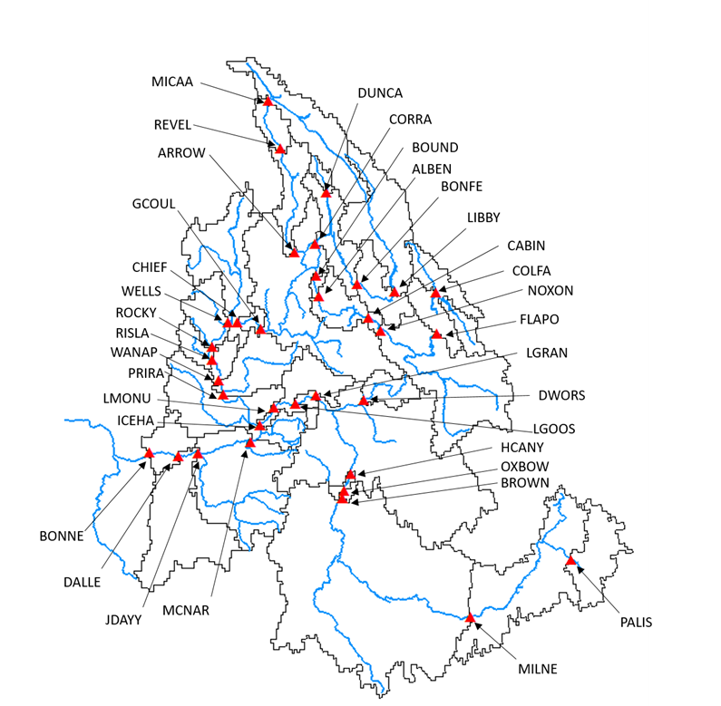

# RColSim
 


The Columbia Simulation model written in R programing language (RColSim) is an open-source river system model that simulates the operation of dams and water systems in the Columbia River Basin (CRB). RColSim simulates 45 dams located across different parts of the CRB, and takes into account various dam-specific and system-wide operational objectives. These objectives include flood protection, hydropower generation, as well as meeting irrigation demands and environmental flow requirements of the CRB.

## Contacts: 
Keyvan Malek (keyvanmalek@gmail.com), Matthew Yourek (matthew.yourek@wsu.edu), and Jennifer Adam (jcadam@wsu.edu)

## File Structure

All the R scripts used by the model are in this GitHub directory. These are:

1.	VIC_data.R – Reads the input file at the beginning of each timestep and assigns the values from the RColSim input file (e.g. ToRColSim_scenario_baseline_supply_and_demand.txt) to each of the variables listed in section A.1.
2.	switches.R – Provides switches and controls the user can change to adjust the priority of objectives and customize model output (see section A.5).
3.	supply_demand.R – Aggregates the streamflow and water demand input data for further processing and assembling of the main RColSim input file.
4.	read_rule_curves.R – Reads in the input rule curve and flow target input files.
5.	RColSim_main.R – The script that runs the RColSim model.
6.	RColSim_eval.R – Generates plots for model evaluation.
7.	PMFs.R – Functions for computing performance metrics that indicate the degree to which reservoir objectives were or were not satisfied.
8.	load_functions_input_file.R – Functions for preparing the RColSim input file.
9.	load_functions.R – Functions called by the main RColSim program (see section A.4).
10.	initialize_model.R ¬– Executes the first timestep of the RColSim model.
11.	flow_to_ColSim.R – Generates the RColSim input file and the global input file.
12.	dataframes.R – Initializes dataframes of output variables.

In addition to the R scripts, there are 6 subdirectories. These are:

1.	Preliminary – Contains the routed flow and bias-corrected flow outputs determined from runoff and baseflow simulated by the VIC model and irrigation demands simulated by the VIC-CropSyst model. It also stores the outputs generated by the supply_demand.R script.
2.	output – The directory to which RColSim outputs are written.
3.	misc – Contains miscellaneous files for reference.
4.	inputs – Contains the input text files required by the supply_demand.R and flow_to_ColSim.R scripts.
5.	Documentation – Reservoir operational, procedural, planning, and regulatory documents upon which the RColSim model is based.
6.	default_rule_curve – Rule curve and flow target input files.


## How to Run the Program
The RColSim model has been developed in R programming language. The following steps are necessary to conduct a simulation:

### 1-	R 
The RColSim model only uses base-R functions and libraries, with the exception of the *xts* package, which is required to run supply_demand.R and flow_to_ColSim.R. The *xts* package will need to be installed. This is done with the install.packages() function. 

## 2- Running RColSim from the Command Line

The RColSim program architecture is illustrated in Fig.2. There are three R scripts that need to be executed. The first script converts the monthly, bias-corrected VIC flows and daily water demands to weekly natural streamflow and weekly water demands, adjusted for curtailment. The second script in the workflow takes the output from *supply_demand.R*, combined with rule curve data from the *default_rule_curves* subdirectory, and creates the global input and RColSim input file. The third and final step in the workflow is the main RColSim program, which simulates reservoir operation.
The following code shows how to execute the program from the command line. If you are running in RStudio, click on the “Terminal” tab to run the following commands. The forcing data set for this example is called “Historical_baseline”, indicating that we want to use the streamflow and irrigation demands simulated using gridded historical climate data. The second argument indicates whether the streamflow inputs account for surface water withdrawals. The *supply_only* option uses natural streamflow (no water withdrawals). The *supply_and_demand* option uses unregulated streamflow (flow after removing consumptive water demand). 

_> cd ~/Documents/RColSim_tutorial/RColSimV1_
_> Rscript supply_demand.R “Historical_baseline” “supply_and_demand”_
_> Rscript flow_to_ColSim.R “Historical_baseline” “supply_and_demand”_
_> Rscript RColSim_main.R “Historical_baseline” “supply_and_demand”_

### 2-	Preparation of a weekly streamflow and surface water demand input file for RColSim:
The current version of RColSim works at a weekly time step. Therefore, the streamflow inputs to the model need to be aggregated to a weekly time step. An example input streamflow dataset is included in the following repository:
“/inputs/Supply_to_RColSim/ToRColSim_scenario_baseline_with_curtailment.txt”
The unregulated water supply input columns are designated by the “PriVIC” prefix. These flows should be routed to each of the dams if you are including your own water supply data. Alternatively, the no-regulation, no-irrigation (NRNI) dataset from the Bonneville Power Administration (BPA) can be used.
Weekly surface water demands (withdrawals for municipal water and irrigation, excluding conveyance losses) are also included in the RColSim input file. The aggregation area for these demands corresponds with the drainage areas between the dam indicated after the “DemVIC” prefix and the nearest upstream dam. The water demand in the DemVIC columns was calculated from VIC-CropSyst simulated irrigation demands, not including conveyance losses, as well as surface water municipal demands where those data were available.  The model subtracts water demand from naturalized flow in the incremental drainage area between each dam and its nearest upstream neighbors. These drainage areas are shown in Figure 1. If the user wishes to run RColSim with naturalized flows (demands already removed), the demand columns in the input file need to be replaced with zeros to avoid double-counting water demand. 

<p align="center">



*Incremental drainage areas for each dam represented in RColSim.*

</p>

Inflow to a downstream dam is calculated as the sum of outflow from immediate upstream dams plus incremental supply with demands removed (Eq. 1). Incremental supply is the difference between supply to a downstream dam and supply to all immediately upstream dams. Water demand corresponds with the same drainage area as incremental supply and is included in the input file. The orientation of dams represented in RColSim is shown in Table 1.


$$

Inflow_{downstream} = Flow_{incremental} + Demand_{incremental} + \sum{Outflow_{upstream}}

$$

<p align="center">


*Upstream-downstream orientation of dams in RColSim.* 

</p>

### 3-	Update the Global Input File 
A global input file exists in the “RColSim/inputs” folder which needs to be updated. The current file is called “Global_Input_File_Historical_baseline”, however, users can update the name and address of this file and correct line 36 of the “RColSim.R” file accordingly. The current global input file can be found here: “RColSim/inputs/Global_Input_File_Historical_baseline.txt”

The global input file has the following values:

-	**RColSim_WD** : 
RColSim working directory indicates where the main RColSim model is located.
 
-	**Flow_Input_File** : 
Input file to RColSim.

-	**Output_Folder** : 
The folder where program stores the output files.

-	**simulation_start_year** : 
The year that simulation starts. The start month cannot be specified because RColSim has to start from August when operation year starts.

-	**simulation_end_date** : 
The date that simulation ends. Unlike start year, this value has to be an actual date.

-	**input_start_date** : 
Here, the model user specifies the start date of RColSim input file.

-	**input_end_date** : 
End date of RColSim input file.

### 4- Other Model Inputs
The users that are only interested in running the baseline scenarios of RColSim do not need to adjust any other input files. However, there are some modeling options that can be specified in “Switches.R”. For example, users can specify if they want to conduct the simulation under the perfect forecast condition or predefined refill curves by setting “PfctForecast_Refill_Targ” or “SQuo_Refill_Targ” values to 1. There are also additional inputs that can be potentially changed for specific purposes. Examples of these inputs include rule curves that are available in “default_rule_curves”. 


## License

```
	License: GNU General Public License version 3
	
	
```
