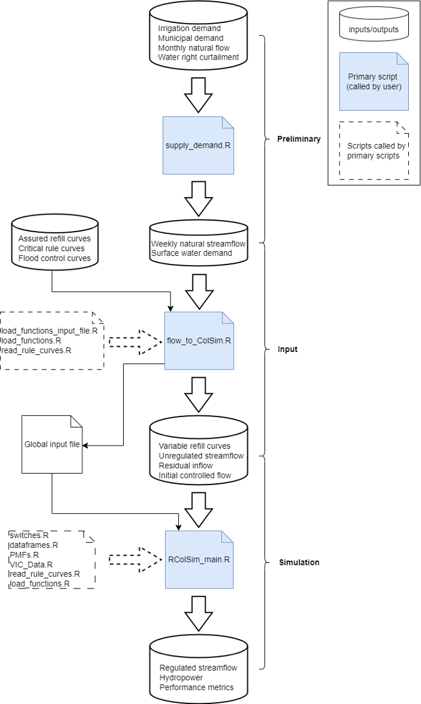
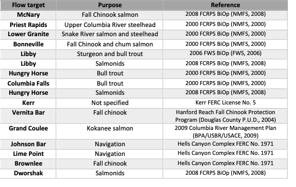
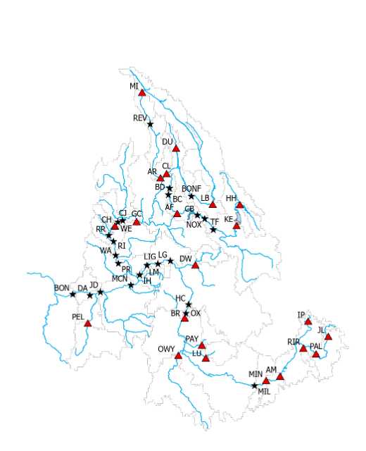

# RColSim
 


The Columbia Simulation model written in R programing language (RColSim) is an open-source river system model that simulates the operation of dams and water systems in the Columbia River Basin (CRB). RColSim simulates 45 dams located across different parts of the CRB, and takes into account various dam-specific and system-wide operational objectives. These objectives include flood protection, hydropower generation, as well as meeting irrigation demands and environmental flow requirements of the CRB.

## Contacts: 
Keyvan Malek (keyvanmalek@gmail.com), Matthew Yourek (matthew.yourek@wsu.edu), and Jennifer Adam (jcadam@wsu.edu)

## RColSim File Structure

All the R scripts used by the model are in this GitHub directory. These are:

1.	*VIC_data.R* – Reads the input file at the beginning of each timestep and assigns the values from the RColSim input file (e.g. ToRColSim_scenario_baseline_supply_and_demand.txt) to each of the variables listed in section A.1.
2.	*switches.R* – Provides switches and controls the user can change to adjust the priority of objectives and customize model output (see section A.5).
3.	*supply_demand.R* – Aggregates the streamflow and water demand input data for further processing and assembling of the main RColSim input file.
4.	*read_rule_curves.R* – Reads in the input rule curve and flow target input files.
5.	*RColSim_main.R* – The script that runs the RColSim model.
6.	*RColSim_eval.R* – Generates plots for model evaluation.
7.	*PMFs.R* – Functions for computing performance metrics that indicate the degree to which reservoir objectives were or were not satisfied.
8.	*load_functions_input_file.R* – Functions for preparing the RColSim input file.
9.	*load_functions.R* – Functions called by the main RColSim program (see section A.4).
10.	*initialize_model.R* ¬– Executes the first timestep of the RColSim model.
11.	*flow_to_ColSim.R* – Generates the RColSim input file and the global input file.
12.	*dataframes.R* – Initializes dataframes of output variables.

In addition to the R scripts, there are six subdirectories. These are:

1.	*Preliminary* – Contains the routed flow and bias-corrected flow outputs determined from runoff and baseflow simulated by the VIC model and irrigation demands simulated by the VIC-CropSyst model. It also stores the outputs generated by the supply_demand.R script.
2.	*output* – The directory to which RColSim outputs are written.
3.	*misc* – Contains miscellaneous files for reference.
4.	*inputs* – Contains the input text files required by the supply_demand.R and flow_to_ColSim.R scripts.
5.	*Documentation* – Reservoir operational, procedural, planning, and regulatory documents upon which the RColSim model is based.
6.	*default_rule_curve* – Rule curve and flow target input files.


# How to Run the Program
The following provides information on how to conduct a simulation:

## 1-	R 
The RColSim model only uses base-R functions and libraries, with the exception of the *xts* package, which is required to run supply_demand.R and flow_to_ColSim.R. The *xts* package will need to be installed. This is done with the install.packages() function. 

## 2- Running RColSim from the Command Line

The RColSim program architecture is illustrated in Fig.2. There are three R scripts that need to be executed. The first script converts the monthly, bias-corrected VIC flows and daily water demands to weekly natural streamflow and weekly water demands, adjusted for curtailment. The second script in the workflow takes the output from *supply_demand.R*, combined with rule curve data from the *default_rule_curves* subdirectory, and creates the global input and RColSim input file. The third and final step in the workflow is the main RColSim program, which simulates reservoir operation.
The following code shows how to execute the program from the command line. If you are running in RStudio, click on the “Terminal” tab to run the following commands. The forcing data set for this example is called “Historical_baseline”, indicating that we want to use the streamflow and irrigation demands simulated using gridded historical climate data. The second argument indicates whether the streamflow inputs account for surface water withdrawals. The *supply_only* option uses natural streamflow (no water withdrawals). The *supply_and_demand* option uses unregulated streamflow (flow after removing consumptive water demand). 

_> cd ~/Documents/RColSim_tutorial/RColSimV1_<br>
_> Rscript supply_demand.R “Historical_baseline” “supply_and_demand”_<br>
_> Rscript flow_to_ColSim.R “Historical_baseline” “supply_and_demand”_<br>
_> Rscript RColSim_main.R “Historical_baseline” “supply_and_demand”_<br>


<p align="center">



<div align="center"><i>Fig. 1. Structure of the RColSim model.</i> </div>

</p>

## 3- Running RColSim on a computing cluster

The following BASH code shows how to simultaneously run multiple climate scenarios in a cluster computing environment. The example uses the TORQUE resource manager to batch process a baseline scenario and a climate scenario using the *bcc-csm1-1* global circulation model (GCM). The inputs for each scenario are included in the Preliminary subdirectory.<br>			

_1 > run_type=supply_and_demand_<br>
_2 > declare -a scr_list=(Historical_baseline bcc-csm1-1_rcp45 bcc-csm1-1_rcp85 bcc-csm1-1_historical)_<br>
_3 > for scr_name in ${scr_list[@]} # loop over the scenarios_<br>
_4 > do_<br>
_5 > export SCR=$scr_name $run_type # export variables to computing node_<br>
_6 > qsub –V VIC_to_RColSim # submit job_<br>
_7 > done_<br>

The file *VIC_to_RColSim* in the parent directory is the script that each computing node executes.

# Mode Inputs
The following inputs are required for RColSim to run:
1)	Unregulated streamflow
2)	Rule curves
3)	Flow targets

## 1) Unregulated streamflow
Unregulated streamflow is the flow that has not been altered by the operation of dams, but that has been affected by water withdrawals. One method of obtaining unregulated flow, and the one used in this tutorial, is computer simulation. As an alternative, there are streamflow products available through the Bonneville Power Administration (BPA) for which the influence of dams have been removed. These are called modified flows. However, the modified flow data product is only available for historical time periods. Streamflow simulations are needed for climate change studies that require streamflow predictions during future time periods. In this tutorial, we show how simulated runoff and baseflow from the large-scale hydrology model, VIC, can be used in conjunction with irrigation demand from the cropping systems model, CropSyst, to generate the unregulated streamflow input to RColSim.

## 2) Rule Curves
Rule curves designate a target reservoir water level or volume throughout the year to achieve objectives such as flood control, irrigation, and hydropower generation. Generally, a rule curve is either an upper limit or a lower limit. The upper limit guides flood control operation, ensuring that enough storage space is available to reduce flood volumes. The lower limits help maintain enough water in the reservoir so that firm energy loads can be met throughout the year and the reservoirs refill by their target refill dates. The variable refill curve, assured refill curve, critical rule curve, and operating rule curve lower limits all fit into this category.
	The target storage volumes for each rule curve are read from diagrams of required storage on the y axis and date on the x axis. A set of curves gives the required storage for different forecasted inflow conditions. An example is the storage reservation diagrams used for guiding the evacuation of reservoirs for flood control. The Army Corps of Engineers, Columbia Basin Water Management Division maintains a repository of such diagrams at https://www.nwd-wc.usace.army.mil/cafe/forecast/SRD/srd.htm.
	In RColSim, the rule curves are supplied in the form of text files in which rows represent week of the year and columns represent the volume of water stored in the reservoir. In transcribing the storage reservation diagrams, we interpolated between the months to derive weekly values, and we converted from required storage space to water stored in the reservoir by subtracting storage space from the full pool volume. Unlike the other rule curves, the variable refill curve is computed using forecasted inflows and assumed releases. The procedure for computing variable refill curves is discussed in section 2.1.2.

## 3) Flow Targets
Most reservoirs have designated flow targets to reduce the negative impact of dams on navigation or anadromous fish spawning, rearing, and migration.  The flow targets included in RColSim are listed in Table 1.


<div align="center"><i>Table 1. Flow targets included in the RColSim model.</i> </div>
<p align="center">

</p>

# Model Input Preparation

## Script 1: Assembling of Inputs

The first script that should be run when preparing an RColSim simulation is supply_demand.R. This script converts model-simulated irrigation demand and runoff to a weekly timeseries of surface water consumptive demand and natural streamflow (i.e., flow without the influenced dams or water withdrawals). The natural streamflow input was constructed from the grid-scale runoff and baseflow simulations of VIC by routing flow to the inlet of each dam, using an algorithm based on Lohmann et al. (1996). The routed flows were subsequently bias-corrected to the no regulation, no irrigation dataset (NRNI) provided by the Bonneville Power Administration and produced by the Army Corps of Engineers. The bias correction procedure is described in Snover et al. (2003). 
The consumptive water demand is assumed to come from two primary sources, agriculture (i.e. irrigation) and residential use. Irrigation demands were simulated using VIC CropSyst, which provides “top-of-crop” water demands (i.e. water that is actually delivered to the field). The fraction of irrigation water coming from a surface water vs groundwater source is estimated from water rights data, watershed plans, and other literature. Refer to Yourek et al. (2023) for a more detailed discussion of how water demand and natural streamflow were derived for the Columbia River Basin. The grid-scale top-of-crop irrigation demands and residential water demands were aggregated to drainage areas that correspond with a flow target control point, an irrigation project, or the drainage area between an upstream dam and the nearest downstream dam. A crosswalk between grid cell and drainage area is included in the file, *misc/station_matches_for_pod_file_2023.txt* for reference. The file, *misc/all_drainages.csv* gives metadata for these drainage areas. 
The supply_demand.R script also calculates curtailment of water rights in tributaries of Washington State with an instream flow rule and adjusts water demand accordingly. Interruptible curtailment of water rights occurs whenever streamflow falls below regulatory minimum flows that are set primarily for the benefit of fish. When this occurs, those with a water right junior to the flow rule are prohibited from diverting until the streamflow once again exceeds the minimum flow. Next, the script aggregates the demand in each drainage to the drainages shown in Fig. 3, which represent the incremental drainage areas between a downstream dam and the nearest upstream dam(s). Refer to the file, inputs/station_mapping for a mapping of the RColSim drainages (first column) to the demand drainages (second column). Lastly, the script calculates the demand from interruptible water rights along the mainstem Columbia River. These water rights are curtailed only in rare circumstances.

## Script 2: Generating the RColSim input file

After *supply_demand.R* is run, the second script to execute is flow_to_ColSim.R. This script compiles the RColSim input file, which consists of the following primary components:

1)	Unregulated streamflow
2)	Variable refill curve
3)	Residual inflow/Cumulative runoff volume

### 1) Unregulated streamflow
	Weekly timeseries of unregulated streamflow is calculated by subtracting the surface water demands from the natural streamflow at the inlet of each of the dams shown in Fig. 3. The water demand upstream of a dam is equal to the sum of demand in all upstream incremental drainage areas (light gray boundaries) in Fig. 3. 
 
### 2) Variable refill curve
Some of the dams have a variable refill curve that guides reservoir refill. The variable refill curve allows a deeper draft than permitted by the assured refill curve, while assuring that the dam will refill by its target date with a high degree of confidence. The computation of a variable refill curve in the flow_to_ColSim.R script consists of recursively solving the storage volume, beginning at the target refill date and working backward. ### 2-	Preparation of a weekly streamflow and surface water demand input file for RColSim:
The current version of RColSim works at a weekly time step. Therefore, the streamflow inputs to the model need to be aggregated to a weekly time step. An example input streamflow dataset is included in the following repository:
“/inputs/Supply_to_RColSim/ToRColSim_scenario_baseline_with_curtailment.txt”
The unregulated water supply input columns are designated by the “PriVIC” prefix. These flows should be routed to each of the dams if you are including your own water supply data. Alternatively, the no-regulation, no-irrigation (NRNI) dataset from the Bonneville Power Administration (BPA) can be used.
Weekly surface water demands (withdrawals for municipal water and irrigation, excluding conveyance losses) are also included in the RColSim input file. The aggregation area for these demands corresponds with the drainage areas between the dam indicated after the “DemVIC” prefix and the nearest upstream dam. The water demand in the DemVIC columns was calculated from VIC-CropSyst simulated irrigation demands, not including conveyance losses, as well as surface water municipal demands where those data were available.  The model subtracts water demand from naturalized flow in the incremental drainage area between each dam and its nearest upstream neighbors. These drainage areas are shown in Figure 1. If the user wishes to run RColSim with naturalized flows (demands already removed), the demand columns in the input file need to be replaced with zeros to avoid double-counting water demand. 

### 3) Residual inflow/Cumulative runoff volume
The flood control curves utilize either residual inflow or cumulative runoff volume to select the curve representing the appropriate relationship between reservoir volume and week of the year. Residual inflow is the remaining volume of unregulated flow to enter the reservoir by the target refill date. It is calculated as Q^t summed over all the timesteps from t to the refill date. Cumulative runoff volume is the total unregulated streamflow volume that has been forecasted to enter the reservoir over a specified period, usually April through August. Residual inflow is used primarily in conjunction with the Upper and Middle Snake River reservoirs, while cumulative runoff volume is used in conjunction with the other reservoirs.

In addition to the primary RColSim inputs discussed above, flow_to_ColSim.R generates the irrigation demands for the Upper Snake drainages, which are used for estimating irrigation withdrawals for the Minidoka, Boise, Payette, and Upper Snake irrigation projects in Southern Idaho. The input file also includes interruptible demands and instream flow rules for computing curtailment along the Columbia mainstem, and return flows from the Columbia Basin Project entering near Wanapum, Priest Rapids, and McNary dams. Finally, the script generates the global input file. The global input file has the following values:

RColSim_WD – The parent directory for the RColSim model. 
Flow_Input_File – The main input file for RColsim.
Output_Folder – The folder where the program writes the output files.
simulation_start_year – The first year of the simulation. The program always begins the first week in August.
Simulation_end_date – The date the simulation ends. This value needs to be an actual date given in the format: yyyy-mm-dd.

The flow_to_ColSim.R script automatically populates the global input file. The user may either change the script or edit the file to change these variables.


<p align="center">

<div align="center"><i>Fig. 2. Incremental drainage areas for each dam simulated in RColSim.</i> </div>

</p>

## Script 3: Main RColSim program

Once the input files have been created, the only required step remaining is to run the script, RColSim_main.R. The  RColSim_main.R script begins by loading the global input file. Then, required scripts are loaded. These are:

	1) load_functions.R
	2) read_rule_curves.R
	3) switches.R
	4) dataframes.R
	5) PMFs.R
	6) VIC_Data.R

load_functions.R - Functions pertaining to the calculation of dam inflows, outflows, rule curves, and hydropower generation for each of the 45 dams simulated in RColSim. Each dam has its own set of functions, which depends on its unique management objectives. The typical storage reservoir has functions governing both its storage volume at a given week of the year, as well as the release required to meet environmental flow and hydropower targets. Run-of-river dams have comparatively few functions because they have limited or no storage. It is assumed that for run-of-river dams, inflow equals outflow. 

read_rule_curves.R – Reads in the text file inputs from the default_rule_curves subdirectory. These text files give the rule curve and target flow values for each week of the year under various flow conditions. The main program uses the cumulative runoff volumes and residual inflows from the input file to interpolate between different flow conditions (represented by columns) in the rule curve text files. 

switches.R – Switches and controls that affect the priority of dam operational objectives and allow the user to control which variables are written to output. See section A.5 for a description of the implemented options. 

dataframes.R - Initializes the output dataframes. The user can add/remove columns to a given dataframe, define a new dataframe, or delete an existing dataframe to customize the output. Note that  water_df, and energy_df, are essential to the code and should not be deleted.

PMFs.R - Functions for calculating model performance metrics. 

VIC_Data.R - Reads the variables from the input file at each time step into the local environment.

Once the necessary scripts are loaded into the R environment, an option is presented to begin a new simulation. If NEW_SIMULATION == TRUE on line 96, then the output files will be overwritten. The default is set to TRUE. Next, the main program begins the simulation. In the first time step, the initialize_model.R script is executed. This script initializes the storage volume of all reservoirs and runs the first timestep of the simulation. The main program executes all the remaining timesteps. At the beginning of each timestep, a set of common variables is initialized (L120-124). These variables are shared among many functions. They are calculated by the first function that invokes them and treated as a constant by subsequent function calls that use their value for calculating other variables. This ensures that values used by multiple functions only need to be calculated once per time step, which significantly enhances computational speed. 
	The core section of the main program computes reservoir releases and regulated inflows for each of the storage reservoirs, and inflow/outflows for each of the run-of-river dams. Inflow to a downstream dam (Q_in) is calculated as the sum of outflow from immediately upstream dams (Q_out) and incremental flow (Q_inc) (see Eq. 2). Incremental flow is the unregulated streamflow generated between the downstream dam and all immediately upstream dams (Eq. 3). Table 2 gives the upstream/downstream positioning of the dams simulated in RColSim.


## License

```
	License: GNU General Public License version 3
	
	
```
