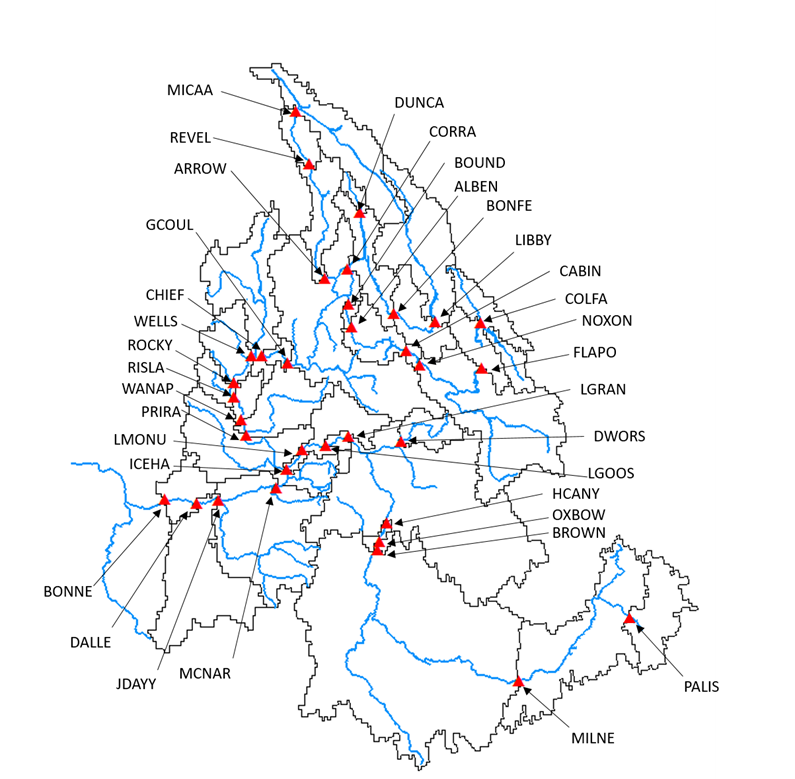

# RColSim
 


The Columbia Simulation model written in R programing language (RColSim) is an open source river system model that simulates the operation of dams and water systems in the Columbia River Basin (CRB). RColSim simulates more than 30 dams located across different parts of the CRB, and takes into account various dam-specific and system-wide operation objectives. These objectives include flood protection, hydropower generation, as well as meeting irrigation and environmental protection demands of the CRB.

## Contacts: 
Keyvan Malek (keyvanmalek@gmail.com), Matthew Yourek (matthew.yourek@wsu.edu), and Jennifer Adam (jcadam@wsu.edu)


## How to Run the Program
The RColSim model has been developed in R programming language. The following steps are necessary to conduct a simulation:

### 1-	R 
The R programing language needs to be available, however, the model has only used functions and libraries that are available in base-R platform. Therefore, no additional library is need to execute the program.


### 2-	Preparation of a weekly streamflow and surface water demand input file for RColSim:
The current version of RColSim works at a weekly time step. Therefore, the streamflow inputs to the model need to be aggregated to a weekly time step. An example input streamflow dataset is included in the following repository:
“/inputs/Supply_to_RColSim/ToRColSim_scenario_baseline_with_curtailment.txt”
The unregulated water supply input columns are designated by the “PriVIC” prefix. These flows should be routed to each of the dams if you are including your own water supply data. Alternatively, the no-regulation, no-irrigation (NRNI) dataset from the Bonneville Power Administration (BPA) can be used.
Weekly surface water demands (withdrawals for municipal water and irrigation, excluding conveyance losses) are also included in the RColSim input file. The aggregation area for these demands corresponds with the drainage areas between the dam indicated after the “DemVIC” prefix and the nearest upstream dam. The water demand in the DemVIC columns was calculated from VIC-CropSyst simulated irrigation demands, not including conveyance losses, as well as surface water municipal demands where those data were available.  The model subtracts water demand from naturalized flow in the incremental drainage area between each dam and its nearest upstream neighbors. These drainage areas are shown in Figure 1. If the user wishes to run RColSim with naturalized flows (demands already removed), the demand columns in the input file need to be replaced with zeros to avoid double-counting water demand. 

<p align="center">



*Figure 1 - Incremental drainage areas for each dam represented in RColSim.*

</p>

Inflow to a downstream dam is calculated as the sum of outflow from immediate upstream dams plus incremental supply with demands removed (Eq. 1). Incremental supply is the difference between supply to a downstream dam and supply to all immediately upstream dams. Water demand corresponds with the same drainage area as incremental supply and is included in the input file. The orientation of dams represented in RColSim is shown in Table 1.


```math

Downstream Inflow = Incremental Flow - Incremental Demand + Sum of Upstream Outflow

```

<p align="center">


*Table 1 - Upstream-downstream orientation of dams in RColSim.* 

</p>

### 3-	Update the Global Input File 
A global input file exists in the “RColSim/inputs” folder which needs to be updated. The current file is called “Global_Input_File_Historical_baseline”, however, users can update the name and address of this file and correct line 36 of the “RColSim.R” file accordingly. The current global input file can be found here: “RColSim/inputs/Global_Input_File_Historical_baseline.txt”

The global input file has the following values:

-	**RColSim_WD** : 
RColSim working directory indicates where the main RColSim model is located.
 
-	**Flow_Input_File** : 
Input file to RColSim.

-	**Output_Folder** : 
The folder where program stores the output files.

-	**simulation_start_year** : 
The year that simulation starts. The start month cannot be specified because RColSim has to start from August when operation year starts.

-	**simulation_end_date** : 
The date that simulation ends. Unlike start year, this value has to be an actual date.

-	**input_start_date** : 
Here, the model user specifies the start date of RColSim input file.

-	**input_end_date** : 
End date of RColSim input file.

### 4- Other Model Inputs
The users that are only interested in running the baseline scenarios of RColSim do not need to adjust any other input files. However, there are some modeling options that can be specified in “Switches.R”. For example, users can specify if they want to conduct the simulation under the perfect forecast condition or predefined refill curves by setting “PfctForecast_Refill_Targ” or “SQuo_Refill_Targ” values to 1. There are also additional inputs that can be potentially changed for specific purposes. Examples of these inputs include rule curves that are available in “default_rule_curves”. 
