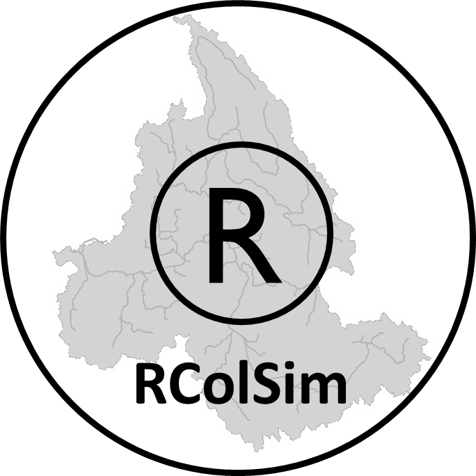

# RColSim
 

The Columbia Simulation model written in R programing language (RColSim) is an open source river system model that simulates the operation of dams and water systems in the Columbia River Basin (CRB). RColSim simulates more than 30 dams located across different parts of the CRB, and takes into account various dam-specific and system-wide operation objectives. These objectives include flood protection, hydropower generation, as well as meeting irrigation and environmental protection demands of the CRB.

