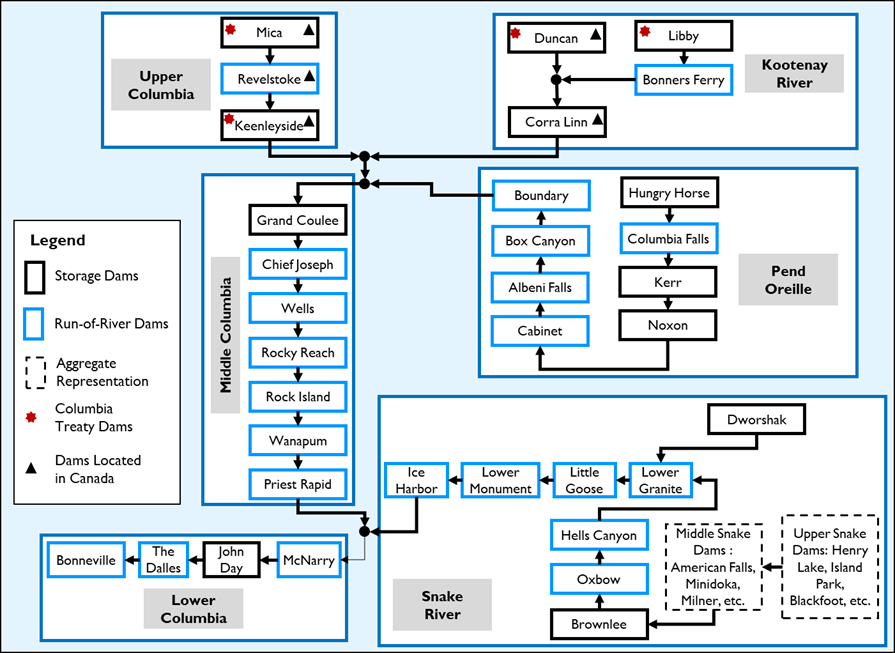

# Summary
The Columbia River water management system is an example of an institutionally-complex human–environmental system that is used to balance the conflicting demands of its food–energy–water (FEW) stakeholders. The system includes more than 30 major storage and run-of-the-river dams that are operated to control floods, produce hydroelectricity, meet irrigation demands, and support environmental flow targets. While FEW stakeholders in the system are already experiencing significant stressors (e.g., droughts, floods, ecosystem impacts), the system is projected to be more vulnerable due to changes in climate while facing potential evolving water management policies (e.g., the transboundary U.S.–Canada Columbia River Treaty). The research community has extensively studied the future of the system using the original version of ColSim (written in Stella); however, to date, the absence of an open-source river-system modeling tool that can efficiently simulate system dynamics for a large ensemble of climate and/or management scenarios has been a limiting technical challenge. In this study, we present RColSim, a script-based river-system model of the Columbia River written in the R programming language. The model considers rule curves and regional constraints to simulate the operation of 33 dams on the Columbia River and also takes system-wide environmental and hydroelectricity targets into account. 

# Statement of need
The Columbia River Basin (CRB) is the largest supplier of hydropower in the Unites States and generates more than 40% of the U.S. hydroelectric energy supply. Additionally, the agricultural sector of the region produces more than 7% of U.S. agricultural commodities in terms of economic value. The CRB’s drainage basin extends to seven U.S. states and the Canadian province of British Columbia and affects many other sectors and stakeholders, such as urban water utilities, fisheries, the recreation industry, and river-based navigation. CRB dams also play a crucial role in protecting the region from flooding dangers [@Jones:2020; @Lee:2009]. The CRB water system carries significant cultural and spiritual importance for various societies, such as Indigenous residents of the region in both the United States and Canada [@Hand:2018; @Wicks-Arshack:2018].

The underlying algorithms used in RColSim were originally coded in a monthly time-step, Stella-based system-dynamics model called ColSim, which was used in a number of different studies to explore climate change impacts on the integrated system [@Hamlet:1999; @Miles:2000], the economic value of long-lead climate forecasts [@Hamlet:2002], flood control optimization [@Lee:2009], Pacific Northwest energy impacts [@Hamlet:2010] , and agriculture production [@Rajagopalan:2018].  Despite wide application of the code, Stella is not a freely available programming platform, and due to the limitations of the coding environment, the original model could not be scripted to run efficiently in ensemble mode, and was not compatible with studies requiring high-performance parallel computing.

The Columbia River system is expected to undergo various types of stressors in the future, including land-use change, climate change, increasing hydrometeorological extremes, and revision of the transboundary agreement between the United States and Canada [Cosens:2010; @Islam:2016; @Krutilla:2018; @Rajagopalan:2018; Rupp:2017]. To explore the ramifications of these transformations, a myriad of scientific papers and projects have focused on the CRB during the last three decades. However, a comprehensive investigation of the impacts of these stressors often necessitates carrying out intensive computational experiments to conduct optimization, sensitivity analysis, and bottom-up assessment. These experiments allow us to investigate system behavior and best management practices under unknown future climatic and socioeconomic uncertainties and stressors [@Herman:2013; @Marchau:2019; @Moallemi:2020; @Quinn:2020]. 

Currently, the authors are not aware of any open-source script-based water-management models of the region that can be deployed on computer clusters for tens of thousands of simulations; the simulation tools used to represent the infrastructural and institutional details of the Columbia River have been either overly simplistic or non-open-source. RColSim responds to these diverse needs and provides a script-based open-source model that can be used in future studies that aim to improve planning and management of water resources in the CRB under deep uncertainty.

# Model Description
ColSim and RColSim follow the reservoir rule curves that are used to guide system operation in the real world. These rule curves include the upper flood-protection rule curve (the dam stage cannot go higher than this level), the lower-limit operating rule curve (the dam stage cannot go below this level), the assured- and variable-refile rule curves (the assured or fixed rule curve is based on an analysis of historical records and is unaffected a specific year’s projected hydrological conditions, while the variable rule curve is responsive to each year’s projected water supply conditions), and the critical rule curves (guides reservoir operation for hydropower generation during low flow years). Each week, system operators select a rule curve on the basis of the season (Figure 2) (\autoref{fig:Figure-2}), projection of water availability during that season, and flood-control projections; RColSim closely follows this operation logic.  Additionally, we have modified several aspects of the code in RColSim. For example, unlike the original ColSim model, irrigation demands in RColSim are provided as a dynamic variable that changes every week. Several past and ongoing projects have used the VIC-CropSyst model to simulate irrigation requirements. We have also improved RColSim simulations compared to the original model by updating the rule curves of Canadian dams (i.e., Mica, Arrow, and Duncan), which are the largest storage facilities in the system. Therefore, RColSim takes advantage of the original widely used conceptual algorithms used in ColSim while using the freeware and data-processing features of the R programming language.

RColSim simulates the operation of more than 30 storage and run-of-river reservoirs in the Columbia River system using a weekly time step. The purpose of the model is to capture the operations and streamflow effects on each dam, which jointly reduce flood risk while meeting agricultural, energy production, and environmental demands in the system. The model is able to simulate the system-wide constraints imposed by the Columbia River Treaty between the United States and Canada. In other words, each reservoir in the system simultaneously handles its dam-specific operation goals (e.g. minimum flows, and rule curve operations) while contributing to system-wide flood protection, energy production, and support for environmental flows. RColSim simulates six main tributaries and dam systems of the CRB: the upper, middle, and lower Columbia basins; Kootenay River Basin; Snake River Basin; and Pend Oreille (Figure 1) (\autoref{fig:Figure-1}).

The model is coded in the R programming language and is designed for parallel computing on high-performance computer clusters. Therefore, the model can be used for the type of large-scale ensemble simulations that are frequently needed for exploratory analysis [@Bankes:1993] and uncertainty quantifications . Additionally, the script-based nature of the model can facilitate online connections to other hydrologic land-surface models as well as other socioeconomic system-dynamics simulation tools.

# Model Evaluation
We compared observed versus RColSim-simulated reservoir signature (defined as the difference between mean monthly streamflow with and without the reservoir effect) at various system reservoirs to assess the performance of our river-system model and show that the model can capture the overall storage dynamics of the system reasonably well (Figure 3) (\autoref{fig:Figure-3}). There are, however, discrepancies that can stem from many simplifying assumptions applied during the abstraction of the complex CRB water system. There are also model limitations associated with uncertainties in streamflow input data, irrigation and energy demands, and rule curves used in the model. 
In addition, Table 1 (\autoref{fig:Table-1}) provides a comparison between simulated and observed weekly dam outflow at the dams included in RColSim. We used the following five performance metrics to explore the performance of RColSim in the simulation of dam outflow: Pearson correlation coefficient (r), mean (relative) error (ME), Kling-Gupta efficiency (KGE; @Gupta:2009), normalized root mean square of error (NRMSE), and volumetric efficiency (VE). These performance metrics are thoroughly defined in Supplemental Materials.

Finally, the Supplemental Materials of this paper provides an additional comparison between observed and simulated dam outflow at all CRB dams represented in RColSim. The information about the original datasets used to conduct the RColSim simulations for this comparison can be found in the Supplemental Materials. Also, observed dam outflow dataset have been discussed in the Supplemental Materials. 

# Model Limitations
There are tributaries within the Columbia system that are currently excluded from RColSim because their water contribution relative to the overall annual flow at the Columbia River scale is negligible. Examples of these tributaries include the Yakima, Walla Walla, and Chelan river basins. RColSim also represents the upper and middle Snake River dams as two hypothetical integrated dams. While these dams do not significantly contribute to the overall water supply of the Columbia River, their absence limits our ability to explore research questions in those specific regions (e.g., the headwater of the Snake River). Therefore, future studies can more explicitly incorporate operational details of dams in those regions and enable RColSim to answer broader ranges of questions at the subbasin scale. While rule curves of Canadian dams have been updated, there are other dams that can benefit from bringing their operations up-to-date (e.g., Brownlee, Hungry Horse and other dams in the Pend Oreille River dam group), and it is our hope that future studies will undertake these kinds of modifications in an open-source environment.

# References
